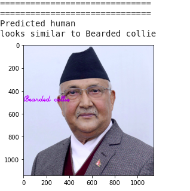
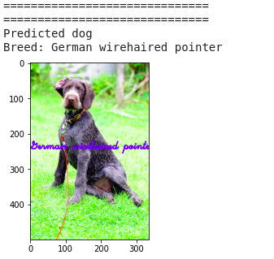
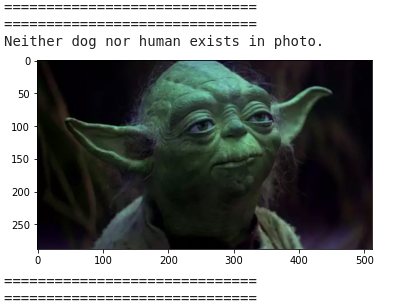

# dog-breed-classifier
This is implementation of classifier which classifies the dogs breeds. This project is associated to deep learning nanodegree udacity.   

# Project Overview
It predicts dog breed given an input image. Additionally , human face can be passed in it to detect similar face resembling breed of dog.

# Run
It is designed to work on google colab. You can run notebook in 
 . 

# Results

